<div style="text-align: center; margin-top: 150px;">

# **TDS**

## **Práctica Gestión de Gastos**

</div>

<div style="text-align: right; margin-top: 350px; color: #CC6600; font-size: 14px;">

**Profesor: Bernardo Cánovas**

**Mohamed Benamrouche Zidi**

**Grupo 3.2**

**DNI:49967993X**

**mohamed.b.z@um.es**

**Fecha entrega: 07/01/2026**

</div>

<div style="page-break-after: always;"></div>

---

## ÍNDICE

1. [Diagrama de Clases del Dominio](#1-diagrama-de-clases-del-dominio)
2. [Historias de Usuario](#2-historias-de-usuario)
3. [Diagrama de Secuencia](#3-diagrama-de-secuencia)
4. [Arquitectura y Decisiones de Diseño](#4-arquitectura-y-decisiones-de-diseño)
5. [Patrones de Diseño](#5-patrones-de-diseño)
6. [Manual de Usuario](#6-manual-de-usuario)

<div style="page-break-after: always;"></div>

## 1. Diagrama de Clases del Dominio

### Diagrama Completo

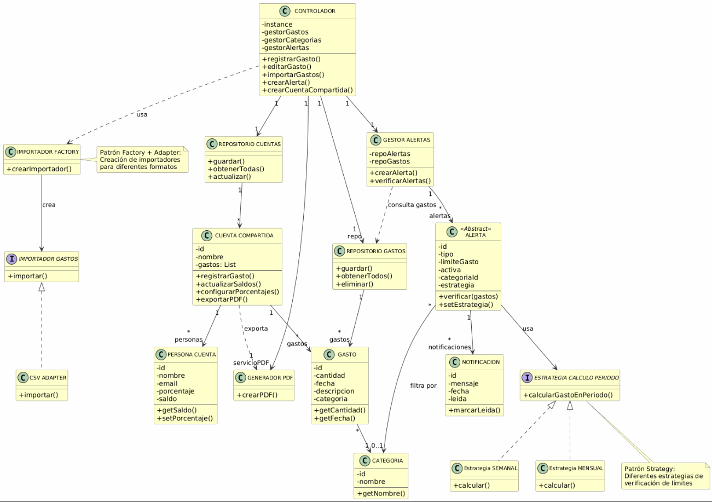

### Explicación del Diagrama

Como vemos en el diagrama de clases, la aplicación está compuesta por varias clases interconectadas que modelan el dominio de la gestión de gastos. La clase Gasto es la entidad central de la aplicación, donde cada gasto dispone de un id único, cantidad, fecha, descripcion y está asociado a exactamente una Categoria mediante una relación de muchos a uno, es decir, muchos gastos pueden pertenecer a una misma categoría. Las categorías representan las clasificaciones predefinidas (Alimentación, Transporte, Ocio, Salud, etc.), y el Repositorio de Categorías mantiene las 8 categorías por defecto, aunque permite crear nuevas automáticamente si se importan gastos con categorías desconocidas desde archivos CSV. La clase GeneradorPDF encapsula el acceso al API correspondiente para manejar archivos PDF, encargándose de crear un archivo PDF con el resumen de gastos del usuario.

El sistema de alertas está diseñado utilizando el patrón Strategy. La clase Alerta dispone de varios atributos importantes: tipo (semanal o mensual), limiteGasto, activa y opcionalmente una categoría para filtrar. El atributo estrategia está marcado como transient, lo que significa que no se serializa a JSON y se reconstruye dinámicamente según el tipo de alerta. La interfaz EstrategiaCalculoPeriodo define el método calcularGastoEnPeriodo(gastos), y las implementaciones EstrategiaSemanal y EstrategiaMensual filtran los gastos de los últimos 7 días o del mes actual respectivamente. El método verificar(gastos) de la clase Alerta utiliza la estrategia configurada para determinar si se ha superado el límite, generando una Notificación en caso afirmativo. Por otro lado, para modelar los gastos compartidos entre personas, la clase CuentaCompartida tiene una lista de PersonaCuenta, donde cada persona tiene un porcentaje asignado (la suma debe ser 100%) y un saldo que se actualiza automáticamente mediante el método actualizarSaldos() cuando se registra un gasto compartido.

La clase Controlador actúa como Singleton y Facade, proporcionando un único punto de acceso a la lógica de negocio mediante métodos como registrarGasto(), editarGasto(), importarGastos() y crearAlerta(). Tanto la interfaz gráfica (VentanaPrincipal, VentanaAlertas, VentanaCuentasCompartidas) como la línea de comandos (GastosCLI) acceden a la misma instancia del controlador, garantizando la consistencia de los datos en todo momento. Cada repositorio también implementa el patrón Singleton y utiliza la librería Jackson para serializar y deserializar objetos en archivos JSON almacenados en la carpeta datos/. Esta arquitectura permite cambiar fácilmente el sistema de persistencia sin modificar la lógica de negocio, ya que los gestores trabajan con interfaces de repositorio (IRepositorioGastos, IRepositorioCategorias, IRepositorioAlertas) en lugar de implementaciones concretas.

---

## 2. Historias de Usuario

### 1. Historia de Usuario: Registrar Gasto
Como usuario de la aplicación, quiero registrar un gasto indicando cantidad, fecha, descripción y categoría, para llevar un control de mis gastos personales.

**Criterios de Verificación:**

- El formulario debe permitir introducir la cantidad (número positivo), fecha, descripción y categoría.
- La categoría se selecciona de una lista predefinida de 8 categorías (Alimentación, Transporte, Ocio, Salud, Hogar, Educación, Ropa, Otros).
- Tras pulsar el botón "Añadir Gasto", el sistema debe validar que todos los campos estén completos y sean válidos.
- Si el registro es exitoso, el gasto debe aparecer inmediatamente en la tabla de gastos.
- Si algún campo no es válido, el sistema debe mostrar un mensaje de error indicando el problema.

### 2. Historia de Usuario: Editar Gasto
Como usuario de la aplicación, quiero editar un gasto existente, para corregir errores sin tener que eliminarlo y crearlo de nuevo.

**Criterios de Verificación:**

- El usuario debe poder seleccionar un gasto de la tabla y pulsar el botón "Editar".
- Se debe abrir un diálogo con los datos actuales del gasto pre-rellenados en los campos.
- El usuario puede modificar cualquier campo (cantidad, fecha, descripción, categoría).
- Al confirmar, los cambios deben guardarse y la tabla actualizarse automáticamente.
- Si el usuario cancela, no se realizan cambios.

### 3. Historia de Usuario: Eliminar Gasto
Como usuario de la aplicación, quiero eliminar gastos que ya no necesito, para mantener mi lista de gastos limpia y actualizada.

**Criterios de Verificación:**

- El usuario debe poder seleccionar un gasto de la tabla y pulsar el botón "Eliminar seleccionado".
- El sistema debe mostrar un diálogo de confirmación antes de eliminar.
- Si el usuario confirma, el gasto se elimina permanentemente de la base de datos.
- La tabla se actualiza inmediatamente tras la eliminación.
- Si no hay ningún gasto seleccionado, el sistema no hace nada.

### 4. Historia de Usuario: Filtrar Gastos
Como usuario de la aplicación, quiero filtrar gastos por categoría, meses específicos y/o rango de fechas, para ver solo los gastos que me interesan.

**Criterios de Verificación:**

- El sistema debe permitir seleccionar una categoría del desplegable para filtrar solo gastos de esa categoría.
- El sistema debe permitir seleccionar uno o varios meses de una lista (Enero, Febrero, etc.).
- El sistema debe permitir indicar un rango de fechas mediante campos "Desde" y "Hasta".
- El sistema debe permitir buscar por texto en la descripción del gasto.
- Los filtros se combinan (AND lógico): un gasto debe cumplir todos los filtros activos.
- Al pulsar "Aplicar Filtros", la tabla muestra solo los gastos que cumplen los criterios.
- Al pulsar "Limpiar", se eliminan todos los filtros y se muestran todos los gastos.

### 5. Historia de Usuario: Configurar Alerta
Como usuario de la aplicación, quiero configurar alertas de gasto semanal o mensual, para recibir avisos cuando supere mi límite establecido.

**Criterios de Verificación:**

- El usuario debe poder crear una alerta seleccionando el tipo (Semanal o Mensual) y un límite en euros.
- Opcionalmente, el usuario puede vincular la alerta a una categoría específica.
- El sistema debe validar que el límite sea un número positivo.
- La alerta creada debe aparecer en la lista de alertas activas.
- El usuario debe poder eliminar alertas existentes seleccionándolas y pulsando "Eliminar".

### 6. Historia de Usuario: Recibir Notificación de Alerta
Como usuario con alertas configuradas, quiero recibir notificaciones cuando supere el límite de gasto, para ser consciente de mis gastos excesivos.

**Criterios de Verificación:**

- Al pulsar "Verificar Alertas" o al importar gastos, el sistema comprueba todas las alertas activas.
- Si el gasto acumulado (semanal o mensual, según el tipo) supera el límite, se genera una notificación.
- Las notificaciones se muestran en el panel de notificaciones con el mensaje y la fecha.
- Las notificaciones no leídas aparecen en negrita.
- El usuario puede marcar todas las notificaciones como leídas.
- El sistema mantiene un historial de notificaciones que puede consultarse activando "Ver historial completo".

### 7. Historia de Usuario: Importar Gastos desde CSV
Como usuario de la aplicación, quiero importar gastos desde un archivo CSV, para no tener que introducirlos manualmente.

**Criterios de Verificación:**

- El usuario debe poder seleccionar un archivo CSV mediante el botón "Importar CSV".
- El sistema debe leer el archivo con formato: cantidad;fecha;descripcion;categoria (separador punto y coma).
- La fecha debe estar en formato dd/MM/yyyy.
- Si una categoría del CSV no existe, el sistema la crea automáticamente.
- Los gastos importados se añaden a la tabla y se persisten en la base de datos.
- Tras la importación, el sistema verifica automáticamente las alertas configuradas.
- Si el archivo tiene un formato incorrecto, el sistema muestra un mensaje de error.

### 8. Historia de Usuario: Crear Cuenta Compartida
Como usuario de la aplicación, quiero crear cuentas de gasto compartidas con otras personas, para dividir gastos grupales y saber cuánto debe cada uno.

**Criterios de Verificación:**

- El usuario debe poder crear una cuenta indicando un nombre y añadiendo al menos 2 personas.
- Cada persona se añade introduciendo su nombre y pulsando el botón "+".
- Por defecto, el porcentaje de gasto se distribuye equitativamente entre las personas.
- El sistema permite configurar porcentajes personalizados (la suma debe ser 100%).
- Una vez creada la cuenta, la lista de personas no puede modificarse.
- La cuenta creada aparece en la lista de cuentas compartidas.

### 9. Historia de Usuario: Registrar Gasto en Cuenta Compartida
Como usuario de la aplicación, quiero registrar gastos en una cuenta compartida indicando quién pagó, para que el sistema calcule automáticamente los saldos.

**Criterios de Verificación:**

- El usuario debe seleccionar una cuenta de la lista para ver sus detalles.
- El usuario debe poder añadir un gasto indicando cantidad, quién pagó y descripción.
- Al añadir el gasto, el sistema actualiza automáticamente los saldos de todas las personas.
- La persona que pagó ve aumentar su saldo (le deben dinero).
- El resto de personas ven disminuir su saldo (deben dinero al grupo).
- Los gastos de la cuenta se muestran en una lista con todos los detalles.

### 10. Historia de Usuario: Ver Gráfico de Gastos
Como usuario de la aplicación, quiero ver gráficos de barras y circulares de mis gastos por categoría, para entender visualmente dónde gasto más.

**Criterios de Verificación:**

- Al pulsar "Gráfico", el sistema muestra un gráfico de barras con el total gastado por categoría.
- Al pulsar "Circular", el sistema muestra un gráfico circular con la distribución porcentual.
- Los gráficos se abren en una ventana nueva.
- El eje Y del gráfico de barras muestra el total en euros.
- El gráfico circular muestra el porcentaje de cada categoría.

### 11. Historia de Usuario: Ver Gastos en Calendario
Como usuario de la aplicación, quiero ver mis gastos representados en un calendario, para visualizar fácilmente cuándo se produjeron.

**Criterios de Verificación:**

- Al pulsar "Calendario", el sistema abre una ventana con un calendario interactivo.
- Cada gasto aparece en su día correspondiente mostrando la descripción y cantidad.
- El usuario puede navegar entre meses para ver gastos pasados o futuros.

### 12. Historia de Usuario: Exportar a PDF
Como usuario de la aplicación, quiero exportar mis gastos a un archivo PDF, para tener un registro imprimible de mis gastos.

**Criterios de Verificación:**

- Al pulsar "PDF", el sistema abre un diálogo para seleccionar la ubicación del archivo.
- El archivo PDF generado incluye la lista de todos los gastos con cantidad, fecha, descripción y categoría.
- El PDF incluye el total de gastos.
- El archivo debe generarse correctamente y guardarse en la ubicación seleccionada.

### 13. Historia de Usuario: Ver Estadísticas
Como usuario de la aplicación, quiero ver estadísticas resumidas de mis gastos, para tener una visión general de mi situación financiera.

**Criterios de Verificación:**

- El panel de estadísticas muestra el total gastado, la media por gasto, la categoría con más gasto y el número de gastos.
- Al pulsar "Actualizar", las estadísticas se recalculan con los datos actuales.

### 14. Historia de Usuario: Gestionar desde CLI
Como usuario de la aplicación, quiero poder gestionar gastos desde línea de comandos, para tener una alternativa a la interfaz gráfica.

**Criterios de Verificación:**

- El sistema proporciona comandos para listar, añadir, editar y eliminar gastos.
- Las operaciones realizadas desde CLI persisten igual que desde la interfaz gráfica.
- Tanto la GUI como la CLI acceden a los mismos datos.

## 3. Diagrama de Secuencia

### Diagrama de Secuencia de Registrar Gasto

Veamos el proceso de ejecución tras pulsar el botón de "Añadir Gasto" desde la ventana principal:

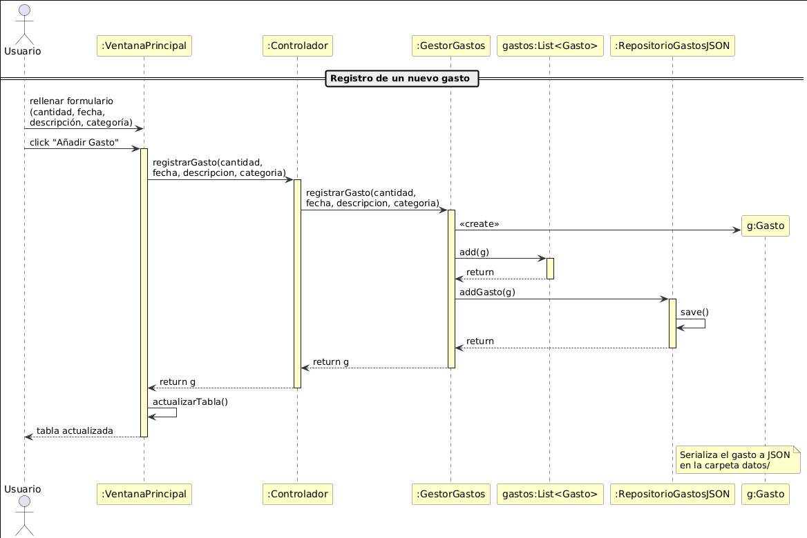

### Explicación del Diagrama

El diagrama de secuencia representa el flujo completo de interacción entre los diferentes componentes del sistema cuando un usuario registra un nuevo gasto. A continuación se describe cada paso del proceso:

**1. Interacción del Usuario con la Interfaz**

El usuario comienza rellenando el formulario de la ventana principal con los datos del gasto: cantidad en euros, fecha mediante el selector DatePicker, descripción textual y categoría seleccionada del desplegable. Una vez completados todos los campos, pulsa el botón "Añadir Gasto" para confirmar la operación.

**2. Llamada al Controlador (Patrón Facade)**

La VentanaPrincipal captura el evento del botón y extrae los valores de los campos del formulario. Seguidamente invoca el método `registrarGasto(cantidad, fecha, descripcion, categoria)` del Controlador, que actúa como punto único de acceso a la lógica de negocio siguiendo el patrón Facade. Esto permite que la interfaz gráfica no tenga conocimiento directo de los gestores internos.

**3. Delegación al Gestor de Gastos**

El Controlador delega la responsabilidad en el GestorGastos llamando a su método `registrarGasto()` con los mismos parámetros. Esta separación permite mantener el Controlador como una capa fina que coordina operaciones, mientras que la lógica específica de gestión de gastos se encapsula en su propio gestor.

**4. Creación del Objeto Gasto**

El GestorGastos crea una nueva instancia de la clase Gasto utilizando los datos recibidos. El constructor de Gasto genera automáticamente un identificador único y asocia el gasto a la categoría correspondiente mediante su ID. El nuevo objeto Gasto se añade a la lista interna de gastos que mantiene el gestor.

**5. Persistencia en el Repositorio (Patrón Repository)**

El GestorGastos llama al RepositorioGastosJSON para persistir el nuevo gasto. El repositorio implementa el patrón Repository, proporcionando una abstracción sobre el almacenamiento. El método `addGasto(g)` añade el gasto a la colección interna y el método `save()` serializa todos los gastos a un archivo JSON ubicado en la carpeta `datos/gastos.json` utilizando la librería Jackson.

**6. Respuesta y Actualización de la Vista**

Una vez completada la persistencia, el flujo de retorno devuelve el objeto Gasto creado hacia arriba en la cadena de llamadas: del Repositorio al Gestor, del Gestor al Controlador, y del Controlador a la VentanaPrincipal. Finalmente, la VentanaPrincipal ejecuta el método `actualizarTabla()` que refresca el contenido de la TableView para mostrar el nuevo gasto recién registrado, proporcionando retroalimentación visual inmediata al usuario.

Este flujo demuestra la correcta separación de responsabilidades entre capas: la vista solo conoce al controlador, el controlador orquesta los gestores, los gestores implementan la lógica de negocio y los repositorios abstraen la persistencia.

---

## 4. Arquitectura de la Aplicación / Decisiones de Diseño

### Arquitectura de la Aplicación

Analizando la arquitectura de nuestra aplicación observamos que se divide en 3 capas que son bastante diferenciadas entre ellas, se comunican entre sí y permiten el correcto funcionamiento de la aplicación. Estas tres capas son: Presentación, Dominio (Negocio) y Persistencia. En nuestro proyecto Java se organiza en los siguientes paquetes: es.um.tds.gastos.vista, es.um.tds.gastos.controlador, es.um.tds.gastos.negocio, es.um.tds.gastos.modelo, es.um.tds.gastos.persistencia, es.um.tds.gastos.importador y es.um.tds.gastos.cli.

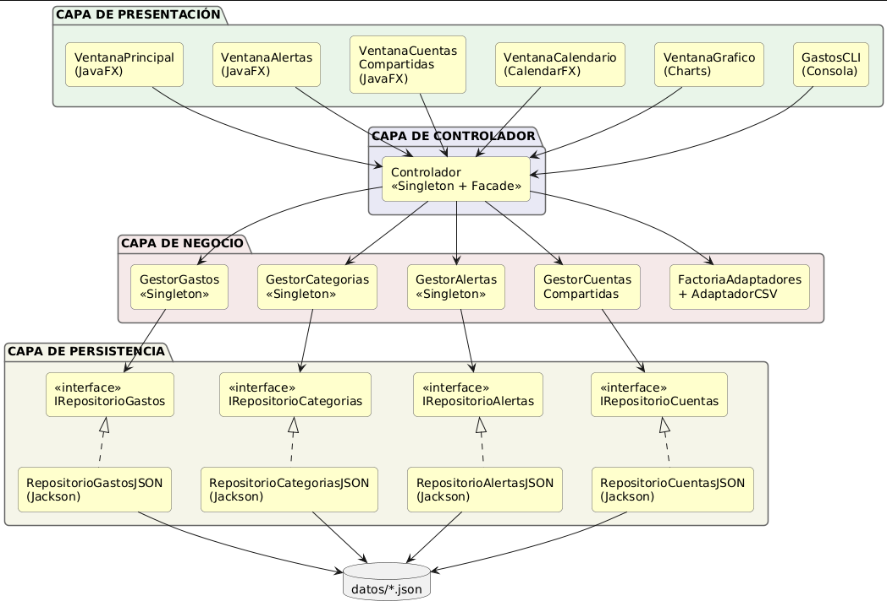

Cada capa tiene una función específica. La primera capa, la de Presentación, es manipulada por el usuario directamente y su función es poner a disposición del usuario las funcionalidades del modelo. Esta capa para comunicarse con la capa del modelo lo hace a través de un controlador único, en nuestro caso la clase Controlador que implementa los patrones Singleton y Facade, siguiendo el principio de separación Modelo-Vista. La aplicación ofrece tanto una interfaz gráfica desarrollada con JavaFX (VentanaPrincipal, VentanaAlertas, VentanaCuentasCompartidas, VentanaCalendario) como una interfaz de línea de comandos (GastosCLI), permitiendo gestionar gastos desde ambas interfaces.

En la capa de Negocio mantenemos toda la lógica de la aplicación: las clases que gestionan y operan con los gastos, las categorías, las alertas y las cuentas compartidas. Los gestores (GestorGastos, GestorCategorias, GestorAlertas, GestorCuentasCompartidas) implementan el patrón Singleton para garantizar que exista una única instancia de cada uno en toda la aplicación. El controlador utiliza la información de los gestores para la capa superior, mientras que los gestores utilizan los repositorios para comunicarse con el servicio de persistencia mediante el patrón Repository.

La última capa, la de Persistencia, define una serie de interfaces (IRepositorioGastos, IRepositorioCategorias, IRepositorioAlertas, IRepositorioCuentas) que permiten a la capa superior comunicarse con el almacenamiento de datos. Estas interfaces están implementadas por clases que utilizan la librería Jackson para serializar y deserializar objetos Java a formato JSON. Los archivos se almacenan en la carpeta datos/ del proyecto (gastos.json, categorias.json, alertas.json, cuentas.json).

### Decisiones de Diseño

Durante el diseño de la aplicación hemos tenido que tomar varias decisiones. Una de las principales fue cómo organizar los paquetes del proyecto para mantener una separación clara entre capas. Decidimos crear paquetes específicos para cada responsabilidad (vista, controlador, negocio, modelo, persistencia, importador, cli), lo que facilita la navegación por el código y el mantenimiento futuro.

Respecto al sistema de alertas, el enunciado indica que deben poder ser semanales o mensuales, por lo que implementamos el patrón Strategy con una interfaz EstrategiaCalculoPeriodo. Cada tipo de alerta tiene su propia estrategia (EstrategiaSemanal, EstrategiaMensual) que calcula el gasto acumulado en su período correspondiente. Esta decisión permite añadir nuevos períodos en el futuro sin modificar la clase Alerta.

Para la importación de datos externos el enunciado indica que el sistema debe estar preparado para diferentes formatos. Implementamos el patrón Adapter con una FactoriaAdaptadores que crea el adaptador adecuado según la extensión del archivo. Actualmente solo existe AdaptadorCSV, pero añadir un AdaptadorXML o AdaptadorExcel solo requiere crear la nueva clase e incluirla en la factoría.

En las cuentas compartidas, el enunciado especifica que por defecto la distribución es equitativa pero se debe permitir definir porcentajes personalizados. Implementamos ambas opciones: al crear la cuenta se calcula automáticamente el porcentaje equitativo (100/n personas), pero el usuario puede modificarlo antes de confirmar. También seguimos la indicación del enunciado de que la lista de personas no puede modificarse una vez creada la cuenta.

Por último, para la interfaz gráfica organizamos los elementos de forma funcional: el panel izquierdo contiene el formulario de entrada, filtros y estadísticas, mientras que el panel derecho muestra la tabla de gastos. Añadimos un ScrollPane al panel izquierdo para que se pueda navegar cuando la ventana es pequeña. La barra de menús proporciona acceso rápido a gráficos, calendario, PDF, alertas y cuentas compartidas.

---

## 5. Patrones de Diseño

### Patrones de Diseño Implementados

#### Patrón Singleton

Este patrón lo hemos aplicado en varias clases clave de la aplicación: `Controlador`, `GestorGastos`, `GestorCategorias`, `GestorAlertas`, `GestorCuentasCompartidas` y `FactoriaAdaptadores`. El objetivo de utilizar este patrón es garantizar que solo exista una única instancia de cada una de estas clases en toda la aplicación, evitando problemas de inconsistencia de datos cuando tanto la interfaz gráfica como la línea de comandos acceden a los mismos recursos.

La implementación sigue la estructura clásica del patrón: cada clase tiene un atributo estático privado `instance` que almacena la única instancia, un constructor privado que impide la creación externa de objetos, y un método estático público `getInstance()` que devuelve la instancia existente o la crea si es la primera vez. Por ejemplo, en el Controlador:

```java
private static Controlador instance;
private Controlador() { /* inicialización */ }
public static Controlador getInstance() {
    if (instance == null) instance = new Controlador();
    return instance;
}
```

Esta decisión fue fundamental para que un gasto añadido desde la GUI aparezca inmediatamente disponible si se consulta desde la CLI, ya que ambas interfaces trabajan con la misma instancia del gestor.

#### Patrón Strategy

Empleado en el sistema de alertas como indica el enunciado de la práctica. El patrón Strategy permite definir una familia de algoritmos intercambiables encapsulados en clases separadas. En nuestra aplicación, la clase `Alerta` utiliza una interfaz `EstrategiaCalculoPeriodo` que define el contrato con el método `calcularGastoEnPeriodo(List<Gasto> gastos)`.

Actualmente existen dos implementaciones concretas:
- **EstrategiaSemanal**: Filtra los gastos de los últimos 7 días desde la fecha actual y suma sus cantidades.
- **EstrategiaMensual**: Filtra los gastos del mes en curso (mismo mes y año que la fecha actual) y suma sus cantidades.

La estrategia se asigna dinámicamente a la alerta según su tipo, permitiendo que el método `verificar()` delegue el cálculo a la estrategia configurada:

```java
public boolean verificar(List<Gasto> gastos) {
    double gastoTotal = estrategia.calcularGastoEnPeriodo(gastos);
    return gastoTotal > limiteGasto;
}
```

El principal beneficio de este patrón es la extensibilidad: añadir un nuevo tipo de alerta (quincenal, trimestral, anual) solo requiere crear una nueva clase que implemente la interfaz, sin modificar el código existente de Alerta.

#### Patrón Adapter

Implementado en el sistema de importación de datos como requiere el enunciado. El patrón Adapter permite convertir la interfaz de una clase en otra interfaz que el cliente espera, haciendo compatible código que de otra forma no lo sería. En nuestra aplicación, los archivos CSV bancarios tienen un formato específico que debe traducirse a objetos de nuestro dominio.

La interfaz `AdaptadorImportacion` define el método `importarGastos(String rutaArchivo)` que devuelve una lista de gastos. La clase `AdaptadorCSV` implementa esta interfaz y realiza la conversión:

1. Lee el fichero línea por línea usando BufferedReader
2. Para cada línea, separa los campos por el delimitador punto y coma
3. Parsea cada campo al tipo correspondiente (Double, LocalDate, String)
4. Crea un objeto Gasto con los datos extraídos
5. Si la categoría no existe en el sistema, la crea automáticamente

El formato esperado del CSV es: `cantidad;fecha;descripcion;categoria` (por ejemplo: `15.50;01/12/2024;Café;Alimentación`). El adaptador encapsula toda la complejidad de parseo y conversión, exponiendo una interfaz limpia al resto del sistema.

#### Patrón Factory Method

Aplicado en la clase `FactoriaAdaptadores` como indica el enunciado. Este patrón define una interfaz para crear objetos, pero permite a las subclases decidir qué clase instanciar. En nuestra implementación, la factoría recibe la extensión del archivo y decide qué adaptador concreto crear.

```java
public AdaptadorImportacion crearAdaptador(String extension) {
    switch (extension.toLowerCase()) {
        case "csv": return new AdaptadorCSV();
        default: throw new IllegalArgumentException("Formato no soportado: " + extension);
    }
}
```

La factoría también implementa el patrón Singleton para garantizar una única instancia. El principal beneficio es la extensibilidad: añadir soporte para nuevos formatos (XML, Excel, OFX) solo requiere crear la clase adaptadora correspondiente y añadir un caso en el switch, cumpliendo con el principio Open/Closed (abierto para extensión, cerrado para modificación).

#### Patrón Repository

Utilizado para desacoplar la capa de persistencia del resto de la aplicación como indica el enunciado. El patrón Repository media entre el dominio y las fuentes de datos, proporcionando una colección de objetos del dominio accesible mediante una interfaz orientada a colecciones.

Cada entidad del dominio tiene su interfaz de repositorio:
- `IRepositorioGastos`: guardar, obtenerTodos, eliminar, buscarPorId
- `IRepositorioCategorias`: guardar, obtenerTodas, buscarPorNombre
- `IRepositorioAlertas`: guardar, obtenerTodas, eliminar, actualizar
- `IRepositorioCuentasCompartidas`: guardar, obtenerTodas, actualizar, eliminar

Las implementaciones concretas (`RepositorioGastosJSON`, `RepositorioCategoriasJSON`, etc.) utilizan la librería Jackson para serializar los objetos a ficheros JSON ubicados en la carpeta `datos/`. Cada repositorio mantiene una caché en memoria que se sincroniza con el archivo JSON mediante los métodos `load()` y `save()`.

Esta abstracción permite que los gestores trabajen con las interfaces sin conocer el mecanismo de persistencia concreto. Si en el futuro quisiéramos cambiar a una base de datos SQL, solo tendríamos que crear nuevas implementaciones de las interfaces sin modificar los gestores.

#### Patrón Facade

El `Controlador` actúa como fachada del sistema, proporcionando una interfaz simplificada para acceder a un subsistema complejo. Expone métodos de alto nivel (registrarGasto, editarGasto, eliminarGasto, importarGastos, crearAlerta, crearCuentaCompartida, etc.) que internamente coordinan múltiples gestores y repositorios.

Por ejemplo, el método `registrarGasto()` del controlador:
1. Delega en GestorGastos para crear y almacenar el gasto
2. Llama a GestorAlertas para verificar si alguna alerta se ha superado
3. Si corresponde, genera notificaciones

La vista no necesita conocer esta orquestación interna ni cómo se relacionan los gestores entre sí. Simplemente llama a un único método del controlador y obtiene el resultado. Esto reduce el acoplamiento entre la capa de presentación y la lógica de negocio, facilitando el mantenimiento y la evolución de la aplicación.

---

### Componentes

Veamos una lista de los componentes JavaFX utilizados en la aplicación:
- **BorderPane**: Contenedor principal que organiza el layout en cinco regiones (top, left, center, right, bottom). Lo usamos como base de VentanaPrincipal para colocar el menú arriba, el formulario a la izquierda y la tabla en el centro.
- **VBox**: Contenedor que organiza los componentes verticalmente uno debajo de otro. Lo usamos para apilar los campos del formulario de entrada y los paneles de filtros.
- **HBox**: Contenedor que organiza los componentes horizontalmente uno al lado de otro. Lo usamos para agrupar botones y campos relacionados en la misma fila.
- **ScrollPane**: Panel con barras de desplazamiento que permite navegar cuando el contenido excede el espacio disponible. Lo añadimos al panel izquierdo para que sea navegable en ventanas pequeñas.
- **TableView**: Componente que muestra datos en formato tabla con columnas ordenables y seleccionables. Lo usamos para mostrar la lista de gastos con sus columnas (cantidad, fecha, descripción, categoría).
- **TextField**: Campo de texto de una línea para introducir datos. Lo usamos para la cantidad, descripción, límite de alerta y nombres de personas.
- **TextArea**: Campo de texto multilínea para introducir textos más largos. Lo usamos en la descripción de gastos compartidos.
- **DatePicker**: Selector de fecha con calendario desplegable que facilita la selección de fechas. Lo usamos para la fecha del gasto y los filtros por rango de fechas.
- **ComboBox**: Menú desplegable que presenta una lista de opciones seleccionables. Lo usamos para seleccionar la categoría, el tipo de alerta y el pagador en cuentas compartidas.
- **ListView**: Lista que muestra elementos seleccionables con soporte para selección múltiple. La usamos para mostrar los meses de filtro, las alertas activas y las notificaciones.
- **Button**: Botón que ejecuta una acción al pulsarlo. Los usamos en toda la aplicación para añadir gastos, aplicar filtros, crear alertas, etc.
- **Label**: Etiqueta de texto para mostrar información estática o dinámica. La usamos para mostrar títulos, estadísticas y mensajes informativos.
- **MenuBar**: Barra de menús horizontal en la parte superior de la ventana. La usamos para acceder a las funcionalidades principales (gráficos, calendario, PDF, alertas, cuentas).
- **Menu y MenuItem**: Menús desplegables y sus opciones. Los usamos dentro de MenuBar para organizar las acciones disponibles.
- **BarChart**: Gráfico de barras para visualizar datos comparativos. Lo usamos para mostrar el total gastado por cada categoría.
- **PieChart**: Gráfico circular para visualizar proporciones. Lo usamos para mostrar la distribución porcentual de gastos por categoría.
- **Alert**: Ventana de diálogo modal para mostrar mensajes de información, advertencia, error o confirmación. La usamos para validaciones y confirmaciones.
- **Dialog**: Ventana de diálogo personalizable para crear formularios emergentes. La usamos para editar gastos y añadir personas a cuentas.
- **TitledPane**: Panel colapsable con un título que permite mostrar u ocultar su contenido. Lo usamos en los paneles de filtros y estadísticas.
- **Spinner**: Selector numérico con botones de incremento y decremento. Lo usamos para introducir porcentajes en cuentas compartidas.

### Librerías

Veamos qué librerías han sido importadas gracias a Maven:
- **org.openjfx:javafx-controls**: Contiene todos los componentes básicos de JavaFX (Button, TextField, TableView, DatePicker, etc.). Es la dependencia principal para construir la interfaz gráfica.
- **org.openjfx:javafx-fxml**: Proporciona soporte para cargar interfaces desde archivos FXML. Aunque no lo utilizamos activamente (construimos las vistas programáticamente), viene incluido como dependencia.
- **com.fasterxml.jackson.core:jackson-databind**: Librería de alto rendimiento para serializar objetos Java a JSON y deserializarlos de vuelta. La usamos en todos los repositorios para persistir y recuperar datos.
- **com.fasterxml.jackson.datatype:jackson-datatype-jsr310**: Módulo adicional de Jackson que añade soporte para los tipos de fecha de Java 8 (LocalDate, LocalDateTime). Necesario porque usamos LocalDate en los gastos.
- **com.calendarfx:view**: Componente avanzado de calendario para JavaFX desarrollado por DLSC. Proporciona visualizaciones de día, semana y mes. Lo usamos para mostrar los gastos en un calendario mensual interactivo.
- **com.itextpdf:itext7-core**: Librería profesional para crear y manipular documentos PDF. La usamos en GeneradorPDF para exportar el listado de gastos a un archivo PDF formateado.
- **org.slf4j:slf4j-simple**: Implementación simple del framework de logging SLF4J. CalendarFX requiere una implementación de SLF4J y esta es la más ligera disponible.

## 6. Manual de Usuario

### 6.1 Requisitos del Sistema

- **Java 21** o superior
- **Maven 3.8+** para compilar
- Resolución mínima: 1280x720

### 6.2 Instalación y Ejecución

```bash
# Clonar el repositorio
git clone https://github.com/mohaxx7/TDS-GestionGastos.git
cd TDS-GestionGastos

# Compilar y ejecutar interfaz gráfica
mvn clean javafx:run

# Ejecutar desde CLI
mvn exec:java -Dexec.mainClass="es.um.tds.gastos.cli.GastosCLI"
```

### 6.3 Ventana Principal

Al iniciar la aplicación se muestra la ventana principal, que está organizada en tres áreas claramente diferenciadas. En la parte izquierda encontramos el formulario de registro de gastos y un panel de estadísticas rápidas que muestra el total gastado, la media por gasto y la categoría con mayor gasto. En la zona central se ubica el panel de filtros, que permite buscar gastos según diferentes criterios. Finalmente, a la derecha está la tabla de gastos donde se visualizan todos los registros con sus datos completos. La interfaz ha sido diseñada para ofrecer acceso rápido a todas las funcionalidades sin necesidad de navegar entre múltiples ventanas.

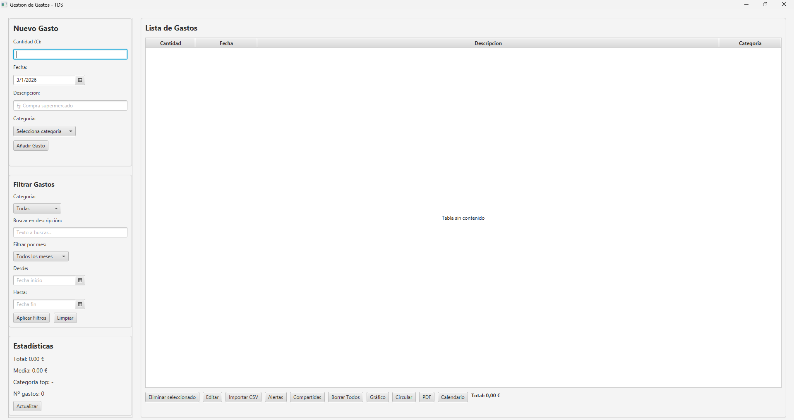

### 6.4 Registrar un Gasto

Para registrar un nuevo gasto utilizamos el formulario situado en el panel izquierdo de la ventana principal. El proceso es sencillo: primero introducimos la cantidad en euros (solo valores positivos), después seleccionamos la fecha utilizando el selector de calendario, a continuación escribimos una breve descripción que nos ayude a identificar el gasto y finalmente elegimos la categoría correspondiente del desplegable (Alimentación, Transporte, Ocio, Salud, Hogar, Educación, Ropa u Otros). Una vez completados todos los campos, pulsamos el botón "Añadir Gasto" y el registro aparece inmediatamente en la tabla de la derecha. Si algún campo está vacío o contiene datos inválidos, el sistema mostrará un mensaje de error indicando qué debe corregirse.

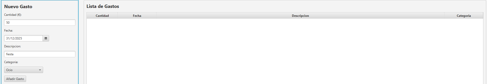

### 6.5 Lista de Gastos

La tabla de gastos muestra todos los registros almacenados en el sistema de forma ordenada. Cada fila representa un gasto individual con cuatro columnas: la cantidad en euros, la fecha en que se produjo, la descripción introducida y la categoría asignada. Podemos ordenar la tabla haciendo clic en las cabeceras de las columnas, lo que resulta útil para encontrar rápidamente los gastos más grandes o los más recientes. Al seleccionar una fila, podemos realizar acciones sobre ese gasto específico utilizando los botones de "Editar" y "Eliminar" situados debajo de la tabla. Las columnas se ajustan automáticamente al ancho disponible para aprovechar todo el espacio de la ventana.

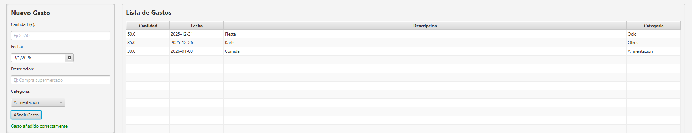

### 6.6 Filtrar Gastos

El panel de filtros ofrece múltiples opciones para buscar gastos específicos. Podemos filtrar por categoría seleccionando una del desplegable, por mes concreto, por rango de fechas indicando una fecha de inicio y otra de fin, o por texto buscando coincidencias en la descripción de los gastos. Lo más potente de este sistema es que los filtros se combinan entre sí con lógica AND, es decir, un gasto debe cumplir todos los criterios activos para aparecer en los resultados. Por ejemplo, podemos buscar "todos los gastos de Transporte del mes de Diciembre que contengan la palabra metro". Para aplicar los filtros pulsamos "Aplicar Filtros" y la tabla se actualiza mostrando solo los resultados. El botón "Limpiar" elimina todos los filtros y vuelve a mostrar el listado completo.

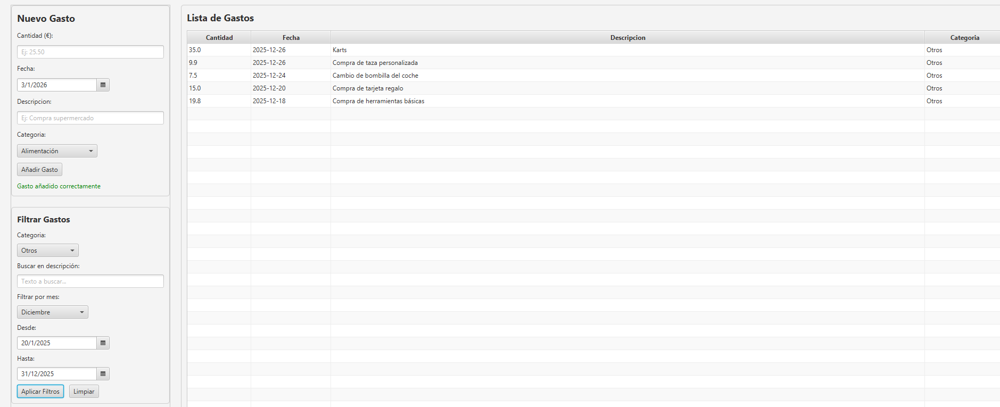

### 6.7 Editar un Gasto

Para modificar un gasto existente, primero lo seleccionamos en la tabla haciendo clic sobre él. A continuación pulsamos el botón "Editar", que abre un diálogo emergente con todos los datos del gasto pre-rellenados en los campos correspondientes. Podemos modificar cualquiera de los valores: cantidad, fecha, descripción o categoría. Una vez realizados los cambios, pulsamos "Guardar" para confirmar la edición o "Cancelar" si decidimos no aplicar las modificaciones.

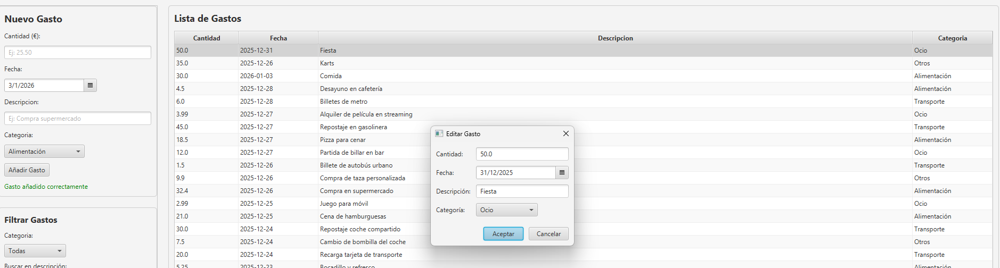

Los cambios se reflejan inmediatamente tanto en la tabla como en las estadísticas, como se puede observar en la siguiente imagen donde el gasto ha sido actualizado.

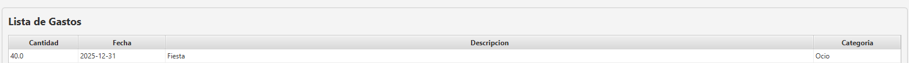

### 6.8 Eliminar un Gasto

Para eliminar un gasto del sistema, lo seleccionamos en la tabla y pulsamos el botón "Eliminar seleccionado". Por seguridad, el sistema muestra un diálogo de confirmación preguntando si realmente deseamos eliminar el registro, mostrando los datos del gasto para asegurarnos de que es el correcto.

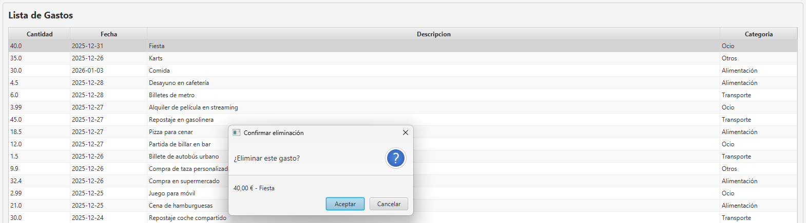

Si confirmamos la eliminación, el gasto se borra permanentemente y la tabla se actualiza mostrando que el registro ya no existe. Esta acción no puede deshacerse, por lo que conviene verificar bien antes de confirmar.

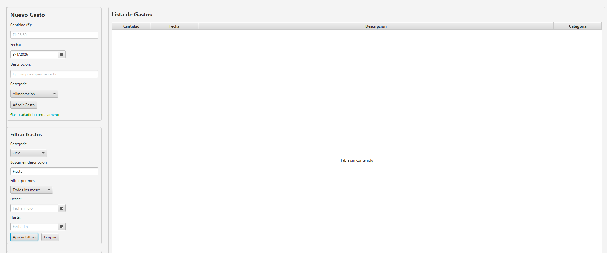

### 6.9 Sistema de Alertas

La aplicación permite configurar alertas para controlar los gastos. Accedemos pulsando el botón "Alertas" en la ventana principal. En la ventana de alertas podemos crear nuevos avisos seleccionando el tipo (Semanal o Mensual), introduciendo un límite en euros y opcionalmente vinculándola a una categoría específica. Las alertas creadas aparecen en la lista de la derecha y podemos eliminarlas seleccionándolas.

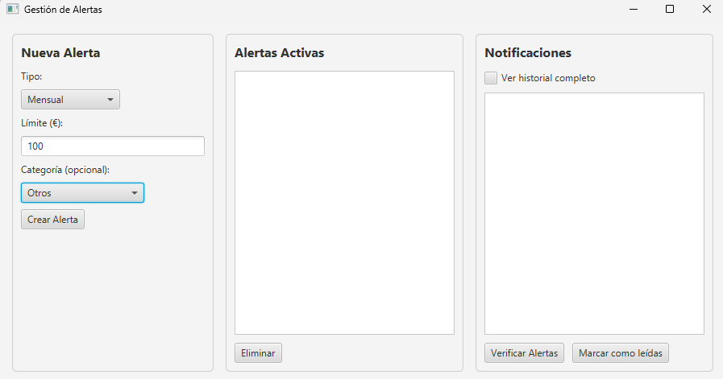

### 6.10 Notificaciones

Cuando el gasto acumulado supera el límite configurado en una alerta, el sistema genera automáticamente una notificación. El panel de notificaciones muestra todos los avisos con su mensaje y fecha. Las notificaciones no leídas aparecen destacadas y podemos marcarlas como leídas. También existe un historial para consultar notificaciones anteriores.

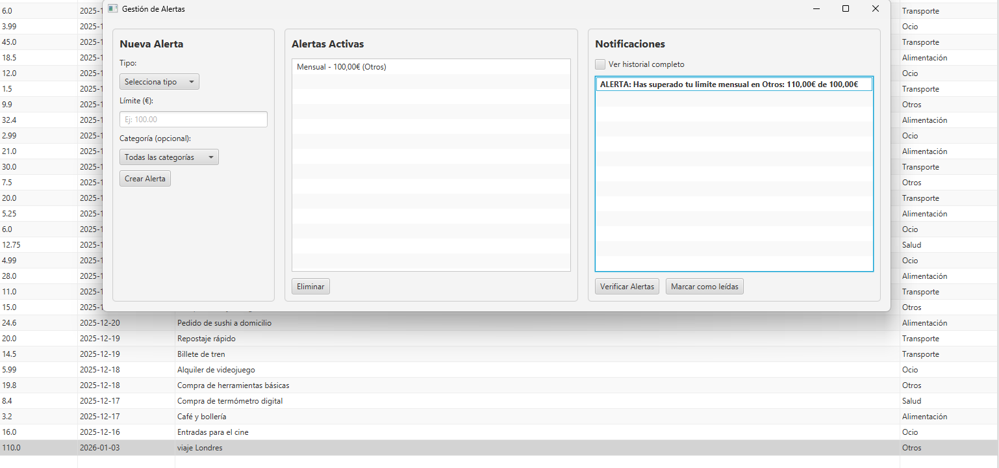

### 6.11 Visualización de Gráficos

La aplicación ofrece dos tipos de gráficos para analizar visualmente los gastos. El gráfico de barras muestra el total gastado en cada categoría, permitiendo identificar rápidamente dónde se concentra el mayor gasto. Es útil para comparar importes absolutos entre categorías.

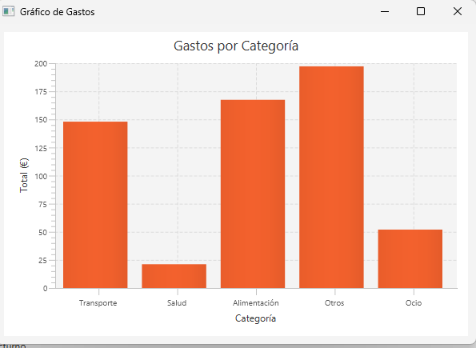

El gráfico circular muestra la distribución porcentual de los gastos, representando qué proporción del total corresponde a cada categoría. Resulta ideal para entender la composición del presupuesto de un vistazo.

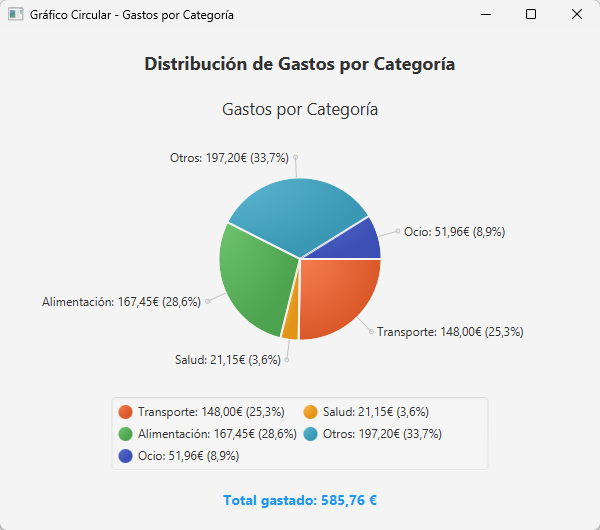

### 6.12 Vista de Calendario

El calendario interactivo permite visualizar los gastos organizados por fecha. Podemos navegar entre diferentes vistas: por semana para ver el detalle diario, o por mes para tener una visión general. Cada gasto aparece en su día correspondiente mostrando la descripción y cantidad.

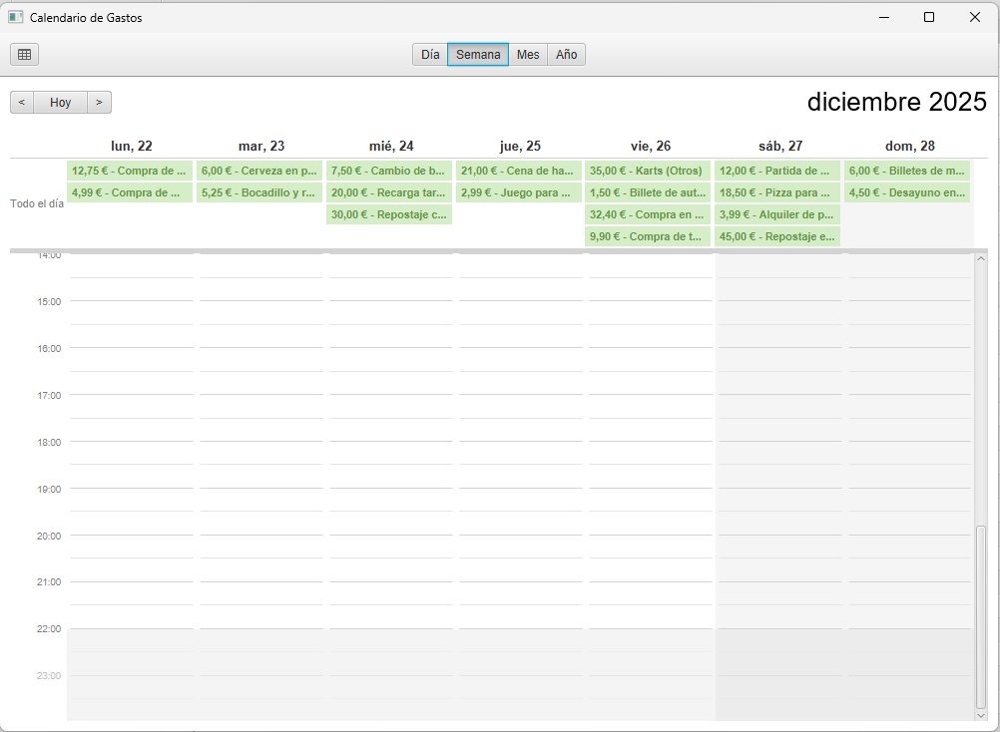

Al hacer clic en un día concreto, podemos ver todos los gastos registrados en esa fecha con más detalle.

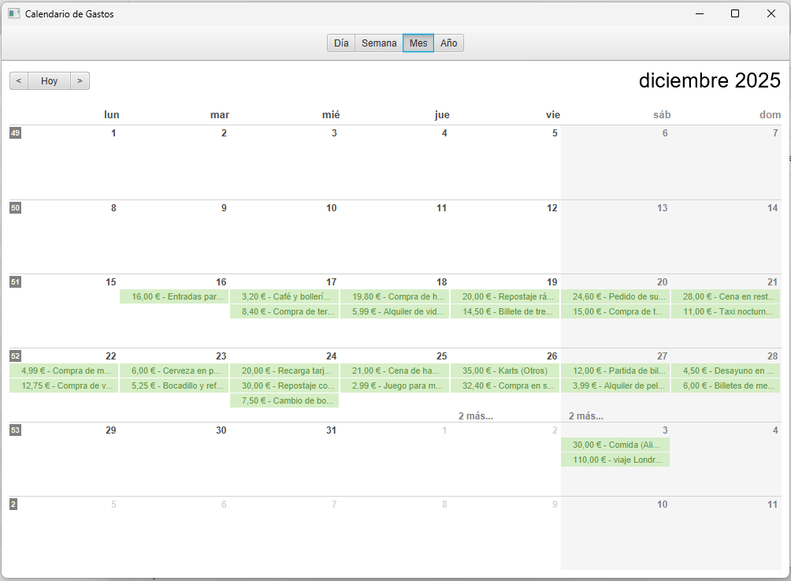

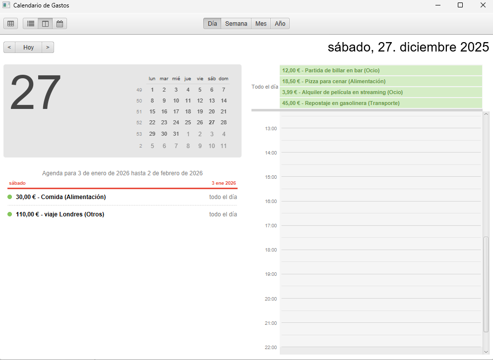

### 6.13 Cuentas Compartidas

Las cuentas compartidas permiten dividir gastos entre varias personas. Para crear una cuenta, introducimos un nombre y añadimos las personas que participarán pulsando el botón "+". Por defecto, los gastos se reparten equitativamente, pero podemos configurar porcentajes personalizados.

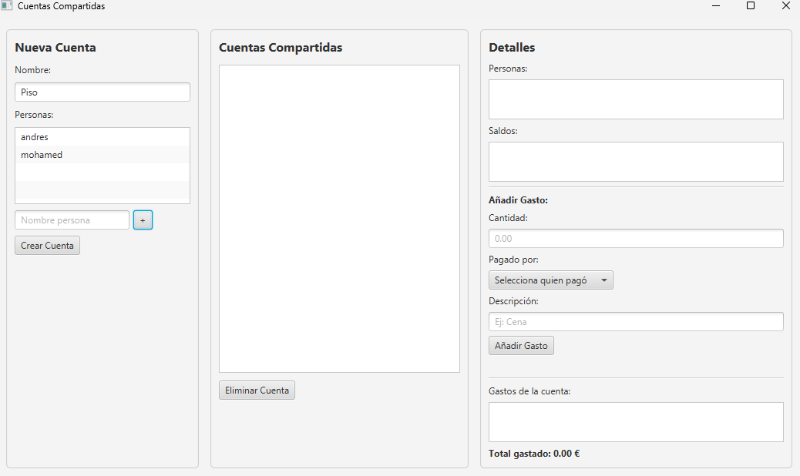

Una vez creada la cuenta, aparece en la lista central. Al seleccionarla podemos ver los detalles: las personas participantes, sus saldos y los gastos registrados.

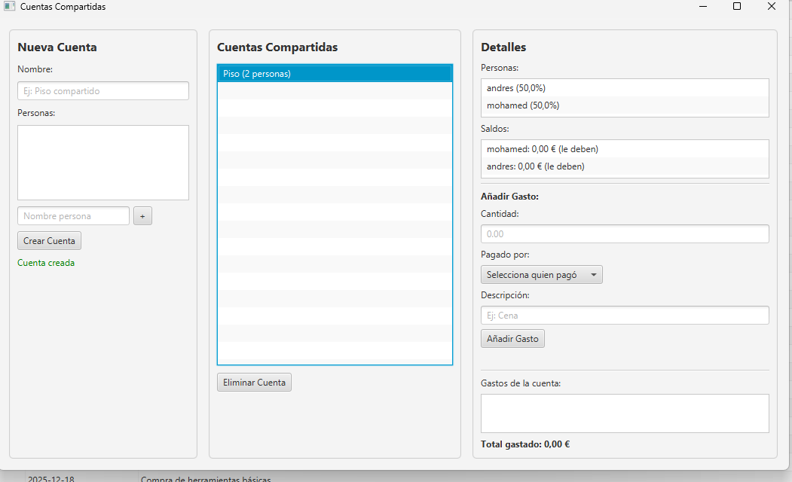

Para registrar un gasto en la cuenta, seleccionamos quién pagó en el desplegable "Pagado por", introducimos la cantidad y descripción, y pulsamos "Añadir Gasto". El sistema calcula automáticamente los saldos: la persona que paga ve aumentar su saldo (le deben dinero) mientras que el resto ve disminuir el suyo (deben dinero al grupo).

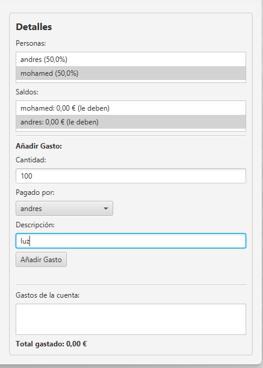

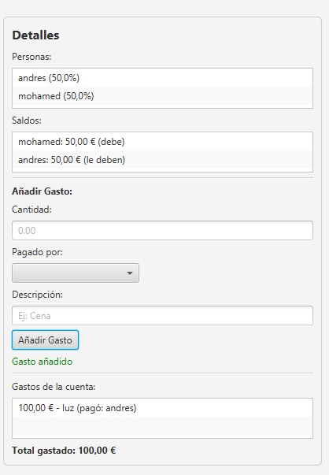

### 6.14 Importar desde CSV

Para importar gastos desde un archivo externo, pulsamos "Importar CSV" y seleccionamos el archivo.

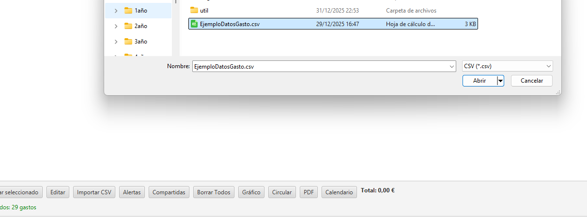

El formato esperado es:

```csv
cantidad;fecha;descripcion;categoria
25.50;15/12/2024;Compra supermercado;Alimentacion
15.00;16/12/2024;Metro;Transporte
```

- Separador: punto y coma
- Fecha: dd/MM/yyyy
- Decimales: punto

Si una categoría del archivo no existe, el sistema la crea automáticamente. Tras la importación, se verifican las alertas configuradas y se muestra un mensaje de confirmación.

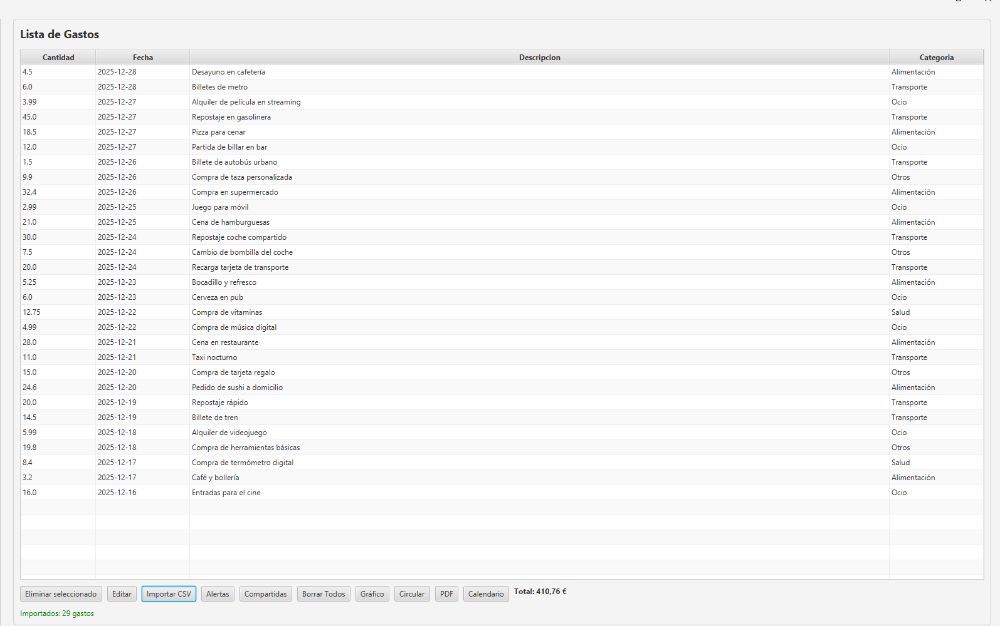

### 6.15 Exportar a PDF

Podemos generar un informe PDF con todos los gastos pulsando el botón "PDF". El sistema abre un diálogo para seleccionar la ubicación donde guardar el archivo.

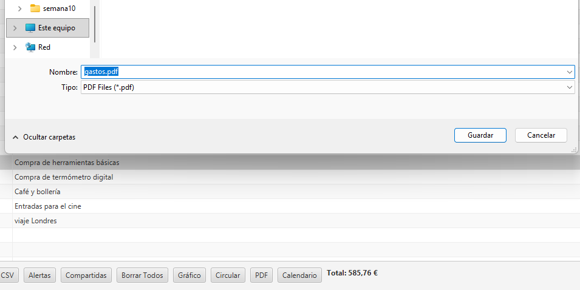

El PDF incluye la lista completa de gastos con todos sus datos y el total acumulado. Una vez generado correctamente, el sistema muestra un mensaje de confirmación.

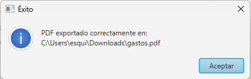

### 6.16 Ver Estadísticas

El panel de estadísticas en la parte inferior izquierda muestra un resumen de los gastos: el total gastado, la media por gasto, la categoría con mayor gasto y el número total de registros. Pulsando "Actualizar" se recalculan los valores con los datos actuales.

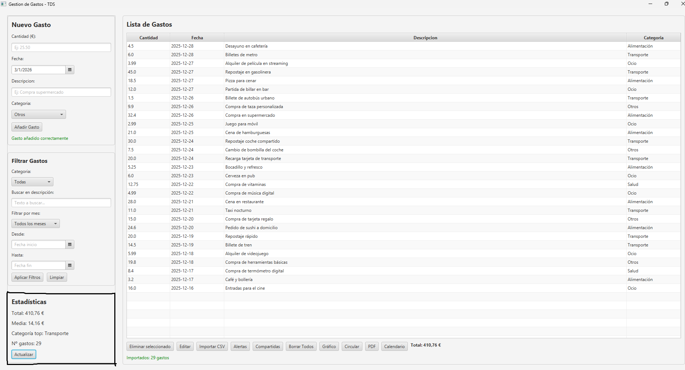

### 6.17 Borrado Masivo

Si necesitamos eliminar todos los gastos de una vez, podemos usar la opción de borrado masivo. El sistema solicita confirmación antes de proceder, ya que es una acción irreversible.

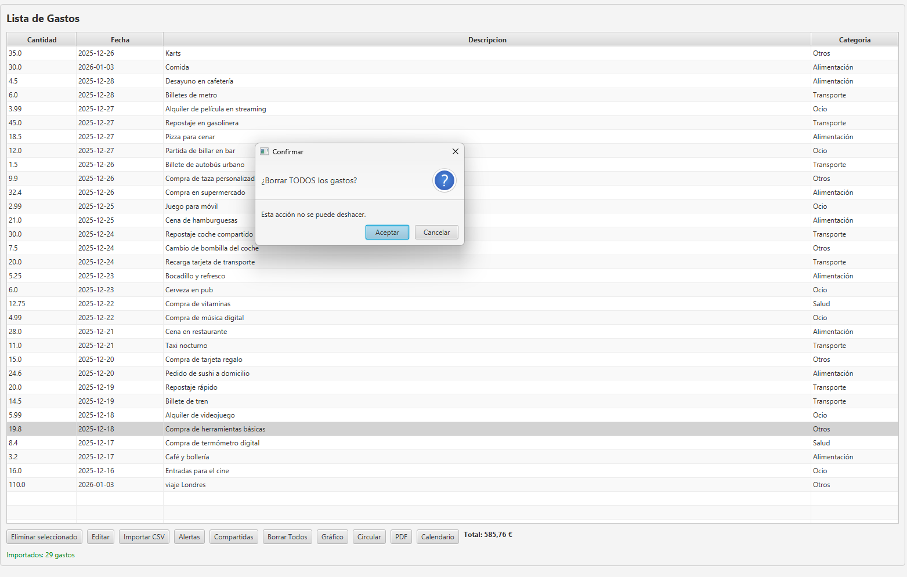

Una vez confirmado, el sistema elimina todos los registros y muestra un mensaje de éxito.

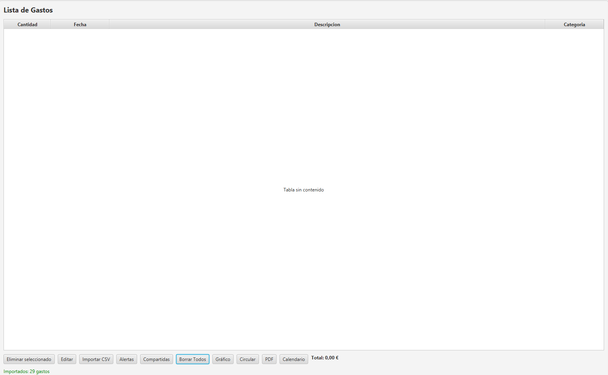

---

